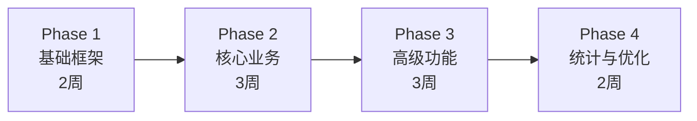

# 智慧居家养老服务平台 — 文档综合评审

> 评审范围：`API接口文档.md`、`smart_elderly_platform_init.sql`、需求分析文档（SRS + 核心需求清单）、数据库设计文档

---

## 一、整体评价

整套文档**完成度较高**，覆盖了认证授权、用户管理、健康管理、安全应急、生活照料、精神慰藉、支付结算、系统管理和数据统计共 **10 个模块、80+ 个 API 接口、26 张业务表**。文档中已考虑 RuoYi 框架适配、WebSocket 实时推送、分表策略、限流降级等技术要点，属于一份**可以直接指导开发的中高质量设计文档**。

---

## 二、设计亮点 ✅

| 维度 | 亮点 |
|------|------|
| **数据库规范** | 每张表都有 `is_deleted`、`create_time`、`update_time` 审计字段，UUID 主键，满足逻辑删除和审计要求 |
| **安全加密** | `id_card`、`phone` 等敏感字段明确标注 "需 AES 加密"，与开发规范一致 |
| **分表策略** | `t_health_record` 和 `t_safety_alert` 标注按年度分表，并提及 ShardingSphere |
| **API 规范** | 统一响应格式、状态码、分页参数、限流策略，RESTful 风格一致 |
| **WebSocket 设计** | 完整定义了 6 种推送事件（预警、健康异常、用药提醒等），心跳机制清晰 |
| **应急响应** | 预警接口标注 ≤3 秒响应要求，不限流，`response_time` 字段用于计算 15 分钟响应率 |
| **业务完整度** | 从注册→下单→服务→评价→结算→提现，完整业务闭环 |

---

## 三、需要改进的问题 ⚠️

### 3.1 数据库设计问题

#### 🔴 关键问题

| # | 问题 | 说明 | 建议 |
|---|------|------|------|
| 1 | **用户体系与 RuoYi 框架冲突** | SQL 中单独建了 `t_system_user`、`t_role`、`t_role_permission` 等表，但 RuoYi 框架自带 `sys_user`、`sys_role`、`sys_menu` 等用户权限表体系 | 后台管理端应**直接复用 RuoYi 自带的权限体系**，新增业务角色通过 RuoYi 菜单/权限机制管理。`t_system_user` 等表建议删除，避免两套权限并存的混乱 |
| 2 | **老人/监护人/服务商没有统一的用户账号表** | 老人、监护人、服务商分别在各自业务表存储登录信息（phone），但缺少一张统一的 **C 端用户账号表** 来管理登录态、密码、Token | 新增 `t_app_user`（C端用户表），包含 `user_id`、`phone`、`password`、`user_type`（elderly/guardian/provider）等字段，业务表通过 `user_id` 关联 |
| 3 | **`t_system_user.password` 注释为 SHA-256 哈希** | RuoYi 默认使用 BCrypt 加密，SHA-256 已不推荐用于密码存储 | 统一使用 **BCrypt** 密码加密，与 RuoYi 保持一致 |
| 4 | **缺少外键约束声明** | 所有表间关联仅通过 COMMENT 注释说明，没有显式外键或明确的关联校验 | 虽然生产环境常不加物理外键，但建议在文档中明确**ER 关系图**，并在 Service 层做好关联校验 |

#### 🟡 建议优化

| # | 问题 | 建议 |
|---|------|------|
| 5 | `t_health_record` 中 `data_source` 和 `collect_method` 语义重叠 | `collect_method` 已有 0-设备/1-手动/2-医院同步，`data_source` 可删除，减少冗余 |
| 6 | `t_safety_alert.handler_role` 为 VARCHAR(20) 硬编码 | 建议改为关联 Role 表或使用枚举常量，避免魔法字符串 |
| 7 | `t_medication_reminder.is_taken` 只记录"今日" | 无法追踪历史服药记录，建议新增 `t_medication_log` 表记录每次服药确认 |
| 8 | `t_service_evaluation.proof_photos` 用逗号分隔存 URL | 建议改为 JSON 数组或拆分为 `t_evaluation_photo` 子表，便于查询和管理 |
| 9 | 缺少**消息/通知表** | WebSocket 推送需要持久化，离线用户上线后需要拉取未读消息 | 建议新增 `t_notification` 表 |
| 10 | 缺少**地理围栏/安全区域表** | 预警类型包含"离开安全区域"，但没有定义安全区域数据表 | 建议新增 `t_safety_zone` 表 |

---

### 3.2 API 接口问题

#### 🔴 关键问题

| # | 问题 | 说明 | 建议 |
|---|------|------|------|
| 1 | **API 路径与 RuoYi 基础路径不一致** | 文档基础路径写 `/api/v1`，但 RuoYi 默认无此前缀 | 需明确：是否在 RuoYi 中统一配置 `context-path: /api/v1`？还是仅业务模块加前缀？ |
| 2 | **RESTful 规范不够统一** | 有些用 `/orders`（复数），有些用 `/order/{id}`（单数），应统一使用**复数名词** | 例如：`/orders/{orderId}`、`/alerts/{alertId}`、`/devices/{deviceId}` |
| 3 | **缺少服务人员位置上报接口** | API 6.2.8 提供了"获取服务人员实时位置"但没有对应的**上报位置**接口 | 需补充 `PUT /staff/{staffId}/location` 位置上报接口 |
| 4 | **缺少批量操作接口** | 健康数据设备批量上报只有单条接口，1000 QPS 场景下效率不高 | 建议增加 `POST /health/records/batch` 批量上报接口 |

#### 🟡 建议优化

| # | 问题 | 建议 |
|---|------|------|
| 5 | 登录接口返回 `refreshToken`，但 RuoYi 原生不支持双 Token | 需要自行扩展 RuoYi 的 Token 机制，或简化为仅用 accessToken + 自动续期 |
| 6 | 服务商结算 T+7 校验逻辑未在 API 文档中体现 | 应明确：T+7 从什么时间节点算（订单完成？评价完成？），校验失败返回什么错误码 |
| 7 | 缺少接口版本管理策略 | 虽然基础路径含 `/v1`，但未说明后续版本如何兼容 |
| 8 | 文件上传接口缺少格式校验说明 | 虽然注释提到了限制，但建议将文件类型和大小限制写入请求参数表 |

---

### 3.3 需求与实现差距

| 需求点 | 文档覆盖情况 | 差距 |
|--------|-------------|------|
| MQTT 设备接入 | ❌ API 文档未涉及 | SQL 和 API 都只定义了 HTTP 上报，**缺少 MQTT 消息主题设计和设备接入协议文档** |
| Redis 缓存策略 | ⚠️ 仅提到"先写入 Redis 缓存队列" | 缺少详细的缓存 Key 设计、过期策略、缓存穿透/雪崩预防方案 |
| 大数据分析 | ⚠️ 统计模块仅提供简单聚合查询 | 项目名称含"基于大数据技术"，但缺少 Spark/Flink 相关的数据分析管道设计 |
| 阿里云 OSS 集成 | ⚠️ 仅在文件上传中提及 | 缺少 OSS 配置、签名直传方案等详细设计 |
| 适老化设计 | ❌ 无前端设计规范 | 需求要求按钮 ≥48px、字体 ≥16px，但无前端 UI 规范文档 |

---

## 四、技术栈难点分析 🔧

### 4.1 难度评估总览

| 技术点 | 难度 | 说明 |
|--------|:----:|------|
| Spring Boot + MyBatis-Plus CRUD | ⭐⭐ | 框架成熟，RuoYi 代码生成器可加速 |
| RuoYi 框架二次开发 | ⭐⭐⭐ | 需要理解 RuoYi 权限体系，扩展多角色用户模型 |
| JWT 双 Token 机制 | ⭐⭐⭐ | RuoYi 原生单 Token，需自行扩展 RefreshToken |
| AES 数据加解密 | ⭐⭐ | 工具类编写简单，但需注意密钥管理 |
| WebSocket 实时推送 | ⭐⭐⭐⭐ | 需处理连接管理、消息可靠投递、离线消息补偿 |
| MQTT 设备接入 | ⭐⭐⭐⭐ | 需搭建 EMQX/Mosquitto Broker，设计设备认证和消息路由 |
| 健康数据高并发写入 (1000 QPS) | ⭐⭐⭐⭐ | 需要 Redis 缓冲 + 异步批量入库，核心架构挑战 |
| 应急预警 ≤3 秒响应 | ⭐⭐⭐⭐⭐ | 涉及设备→MQTT→业务处理→推送全链路优化 |
| ShardingSphere 分表 | ⭐⭐⭐⭐ | 配置复杂，跨分片查询和聚合查询是难点 |
| 微信/支付宝支付集成 | ⭐⭐⭐ | 需申请商户资质，对接 SDK，处理回调验签 |
| 阿里云 OSS 文件管理 | ⭐⭐ | SDK 成熟，签名直传前端需配置 |
| ECharts 大屏数据可视化 | ⭐⭐⭐ | 多图表联动、自适应布局需要精心设计 |
| uni-app 适老化移动端 | ⭐⭐⭐ | 需要适配大字体、高对比度、简化操作流程 |

### 4.2 核心难点深度分析

#### 难点 1：MQTT + 健康数据高并发采集

```
[智能设备] --MQTT--> [EMQX Broker] --> [消费者服务] --> [Redis队列] --> [批量入库Worker] --> [MySQL]
                                             ↓
                                      [阈值校验 + 预警触发]
```

- 需要设计 MQTT Topic 层级：`device/{deviceType}/{deviceId}/data`
- EMQX 需配置设备认证（clientId + password 或证书）
- 消费者服务需做**数据范围校验**（如收缩压 50-200），异常数据标记 `data_status=2`
- Redis 使用 `LIST` 或 `STREAM` 做缓冲队列，定时批量 INSERT
- **这是项目中技术难度最大的部分**，建议优先做技术原型验证

#### 难点 2：应急预警 ≤3 秒全链路

```
设备触发 → MQTT推送(~100ms) → 业务处理+入库(~200ms) → WebSocket推送(~100ms)
                                      ↓
                              短信/电话通知(1-2s, 异步)
```

- 必须保证 WebSocket 长连接的稳定性和快速路由
- 短信/电话通知应**异步化**，不阻塞主流程
- 需要设计**降级方案**：WebSocket 断连时自动切换为短信推送

#### 难点 3：用户体系与 RuoYi 融合

- RuoYi 管理端有一套完整的 `sys_user` + `sys_role` + `sys_menu`
- C 端（老人/监护人/服务商）需要独立的用户认证体系
- **建议方案**：
  - 后台管理端：100% 复用 RuoYi 权限体系
  - C 端（移动端）：新建 `t_app_user` 表 + 独立的 JWT 认证链路
  - 两套认证链路通过**不同的拦截器前缀**区分（如 `/admin/*` vs `/api/*`）

#### 难点 4：支付集成（可降级）

- 微信/支付宝支付需要**企业资质**和**商户号**
- 大创项目可以先做**模拟支付**，预留支付接口但不接入真实渠道
- 结算 T+7 逻辑需要定时任务扫描，建议使用 `XXL-Job` 调度

---

## 五、优先级与开发建议

### 推荐开发顺序



| 阶段 | 内容 | 预估时间 |
|------|------|----------|
| **Phase 1** | RuoYi 搭建 + 用户体系 + 数据库初始化 + 基础 CRUD | 2 周 |
| **Phase 2** | 健康管理 + 服务订单 + 设备绑定（HTTP上报优先） | 3 周 |
| **Phase 3** | 安全应急(WebSocket) + 支付(模拟) + 精神慰藉 | 3 周 |
| **Phase 4** | 数据统计看板 + MQTT 接入 + 分表优化 + 适老化优化 | 2 周 |

### 关键建议

1. **先不做 MQTT**：Phase 1-2 使用 HTTP REST 接口模拟设备上报，Phase 4 再引入 MQTT
2. **支付用模拟**：大创项目不需要真实支付，预留接口封装即可
3. **先不做 ShardingSphere 分表**：开发阶段数据量小，仅保留分表注释和时间索引，生产前再配置
4. **优先做用户体系**：解决 RuoYi 权限 + C 端用户认证的融合问题是第一步

---

## 六、总结

| 维度 | 评分 | 说明 |
|------|:----:|------|
| 文档完整度 | ⭐⭐⭐⭐ | 覆盖面广，API/SQL/需求基本对齐 |
| 技术可行性 | ⭐⭐⭐ | 核心技术栈成熟，但 MQTT + 高并发 + 预警链路是难点 |
| 架构合理性 | ⭐⭐⭐ | 整体合理，但用户体系设计需要重构以适配 RuoYi |
| 开发工作量 | ⭐⭐⭐⭐⭐ | 功能非常多，建议按优先级分期交付 |

> **核心建议**：在开始编码之前，优先解决**用户体系与 RuoYi 融合方案**和**MQTT/WebSocket 技术原型验证**。
